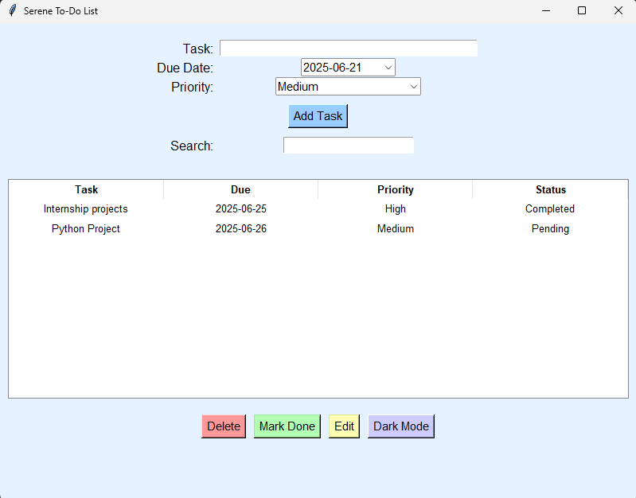
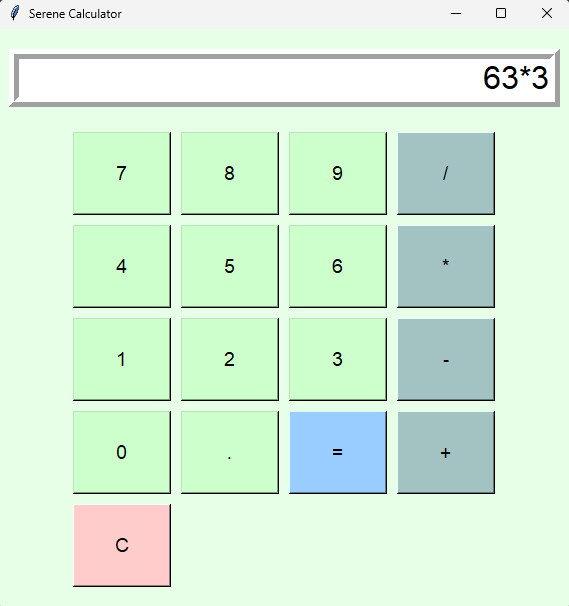
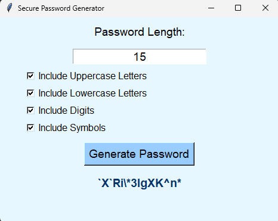
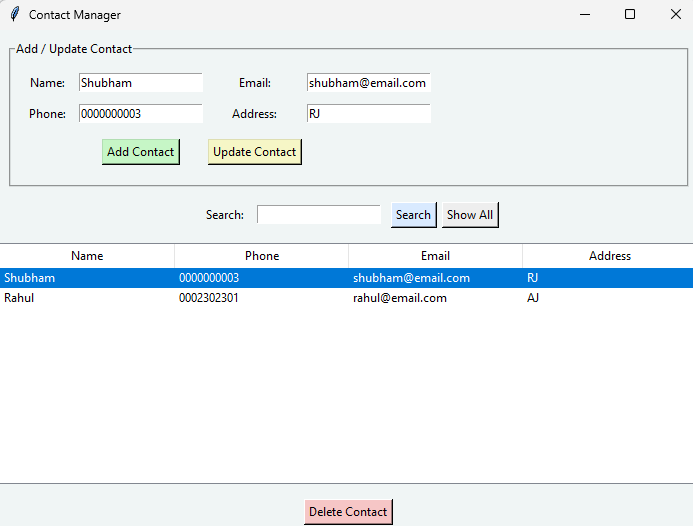

# 🌟 Python GUI Projects Collection

Welcome to a collection of beginner-friendly to advanced GUI-based Python projects using **Tkinter**. Each project is designed with a modern and calm aesthetic, making them both functional and visually appealing.

---

## 📝 Task 1: Advanced To-Do List

### 📌 Description
A feature-rich To-Do List app that helps users manage their daily tasks with an elegant UI.

### ✅ Features
- Dark Mode toggle 🌙
- Add, edit, delete tasks 📝
- Search/filter functionality 🔍
- Calendar date picker 📅
- Drag-and-drop task reordering 🧲

### 🖼 Screenshots
> 

---

## 🧮 Task 2: Advanced GUI Calculator

### 📌 Description
A modern calculator that performs basic arithmetic operations with a friendly and colorful interface.

### ✅ Features
- Addition, Subtraction, Multiplication, Division ➕➖✖️➗
- Result display box
- Responsive UI with button highlighting

### 🖼 Screenshots
> 

---

## 🔐 Task 3: Password Generator

### 📌 Description
Generate secure and random passwords based on user-specified length and complexity.

### ✅ Features
- Specify password length
- Generate mix of uppercase, lowercase, numbers, symbols
- Copy to clipboard button 📋

### 🖼 Screenshots
> 

---

## 👥 Task 5: Contact Manager App

### 📌 Description
A GUI-based Contact Book to manage personal or professional contacts with persistent storage using JSON.

### ✅ Features
- Add, view, update, delete contacts 📇
- Search by name or phone number 🔍
- Save/load contacts using `contacts.json` 🗃
- Clean, calm UI

### 🖼 Screenshots
> 

---

## 🧰 Tech Stack

- **Python 3**
- **Tkinter** – GUI toolkit
- **JSON** – For data persistence
- **Custom Color Palettes** – Calming pastel and soft UIs
- Optionally: `ttkthemes`, `Pillow` (for icons), `os`, `datetime`

---

## 🚀 How to Run

1. Clone this repository  
```bash
git clone https://github.com/shubhamkumarsharma03/CODSOFT.git
cd CODSOFT
cd Python
